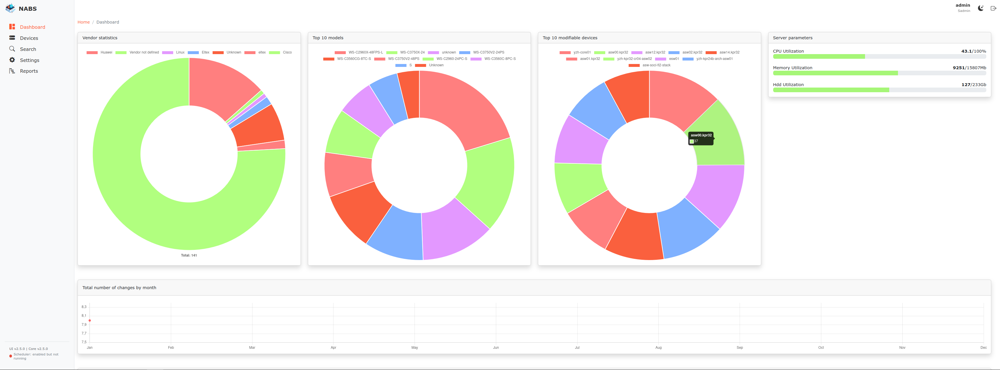
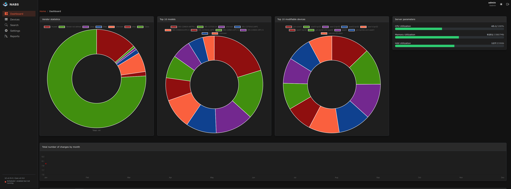
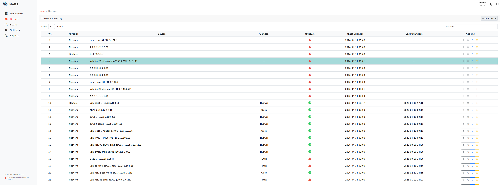
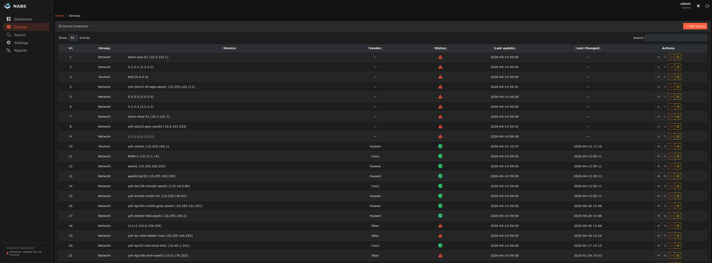
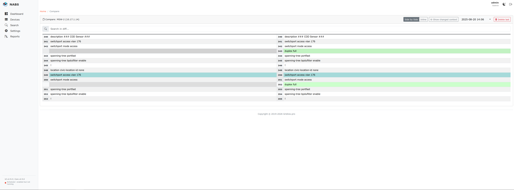
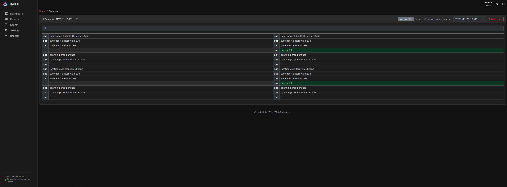

[](https://www.python.org/downloads/release/python-3100/)
[](https://www.python.org/downloads/release/python-3110/)
[](https://www.python.org/downloads/release/python-3110/)
[](https://www.python.org/downloads/release/python-3110/)
[](https://github.com/ambv/black)

# Network Automated BackUp System

This is a network device configuration backup tool.<br/>

**IMPORTANT: READ INSTRUCTIONS CAREFULLY BEFORE RUNNING THIS PROGRAM**


## Requirements
### Software
* python >= 3.10
* nornir
* napalm
* paramiko
* netmiko
* Flask

### Device vendors supported
* Cisco
* Huawei
* Eltex
* If you need another device, then install an additional plugin for NAPALM
* You can create your own drivers in settings
```shell
. venv/bin/activate
pip3 install napalm-"drivername"
```

## Configuration Validation
Beyond backing up configs, NABS can check them against compliance rules you define per driver (e.g. "must contain `aaa new-model`", "NTP servers count >= 2", regex, section-content checks, etc.). Rules run automatically after every backup. See **Settings → Validation Profiles** in the web UI - create a profile, attach it to a driver (or a specific device as a manual override), add rules, and check results per-device on the Devices page or via the per-run report page.

## Screenshots







# Installing

## Ubuntu 20.04 & 22.04
```bash
sudo apt update && sudo apt-get install python3-venv nginx postgresql
```

## Clone repo and install dependencies
* download and setup of virtual environment
```shell
cd /opt
git clone https://github.com/Sivolen/NABS
cd NABS
python3 -m venv venv
. venv/bin/activate
pip3 install --upgrade pip || pip install --upgrade pip
pip3 install wheel || pip install wheel
pip3 install -r requirements.txt || pip install -r requirements.txt
```
## Setup configuration
Copy the [config_example.py](config_example.py) sample settings file to `config.py`.<br/>
Copy the [netbox_config_example.yaml](netbox_config_example.yaml) sample settings file to `config.yaml`.<br/>
If you are not using NetBox, then edit the [netbox_config_example.yaml](netbox_config_example.yaml) according to the [documentation](https://nornir.readthedocs.io/en/latest/tutorial/initializing_nornir.html) or add devices manually use "Add" on devices page. </br>
All options are described in the example file.

### Required secrets
Two separate secret values must be set in `config.py` before the app will start - it refuses to start with an empty/short one:
```python
# Flask session/CSRF secret key
TOKEN = "..."
# Encrypts saved device SSH passwords - must be DIFFERENT from TOKEN, so
# rotating one doesn't make the other's data unusable
CREDENTIALS_ENCRYPTION_KEY = "..."
```
Generate each one with:
```bash
python3 -c "import secrets; print(secrets.token_urlsafe(32))"
```


## init DB
Database creation
```bash
sudo -u postgres psql
CREATE DATABASE NABS;
CREATE USER NABS WITH ENCRYPTED PASSWORD 'NABS';
GRANT ALL PRIVILEGES ON DATABASE NABS TO NABS;
QUIT;
```
Enter the username and password from the database in the configuration file in the fields
```python
DBName = "nabs"
DBUser = "nabs"
```
```bash
. venv/bin/activate
flask db init
flask db migrate
flask db upgrade
```
## Automatic admin creation

On the first start, if no user with the `sadmin` role exists, NABS automatically creates a default administrator:

- **Email:** `admin@admin.local`
- **Username:** `admin`
- **Role:** `sadmin`
- **Auth method:** `local`
- **Password:** randomly generated, printed **once** to console output at that first startup only - it is deliberately **not** written to the application log file (secrets shouldn't sit in rotated/aggregated logs).

If you run NABS via the provided systemd service (`nabs.service`), console output goes to the journal by default, so look it up there right after the very first start:
```bash
journalctl -u nabs --since "10 minutes ago" | grep -A 5 "Default admin user created"
```
If you missed it and the journal has since rotated, the password can't be recovered (it's never stored anywhere) - reset it directly in the database instead:
```bash
. venv/bin/activate
python3 -c "
from app import app, db
from app.models import Users
from werkzeug.security import generate_password_hash
with app.app_context():
    user = Users.query.filter_by(email='admin@admin.local').first()
    user.password = generate_password_hash('YOUR_NEW_PASSWORD_HERE')
    db.session.commit()
    print('Password reset OK')
"
```

You can log in with these credentials and change the password after the first login. This feature eliminates the need to manually run `create_user.py` for the initial setup.

> **Note:** If you need to create additional users or manually set a specific password, you can still use the `create_user.py -a <email>` script.
## Running the web server
```bash
. venv/bin/activate
# For test start
gunicorn -b yourserveraddress:8000 -w 4 app:app
```
```bash
sudo ln -s /opt/supervisor/nabs.service /etc/systemd/system/nabs.service
systemctl daemon-reload
systemctl start nabs
systemctl enable nabs
# Testing starts
systemctl status nabs
```
## Configure Nginx
```bash
# Create dir for ssl certificate
mkdir certs
# Create ssl certificate
openssl req -new -newkey rsa:4096 -days 365 -nodes -x509 \
  -keyout certs/key.pem -out certs/cert.pem

sudo rm /etc/nginx/sites-enabled/default
sudo cp /opt/NABS/supervisor/nabs /etc/nginx/sites-available/nabs
sudo ln -s /opt/NABS/supervisor/nabs /etc/nginx/sites-available/nabs
sudo ln -s /etc/nginx/sites-available/nabs /etc/nginx/sites-enabled/nabs
sudo systemctl restart nginx
```
## Setting up the backup scheduler (systemd service)

The scheduler runs as a separate systemd service (`nabs-scheduler`). It reads the schedule from the database (table `scheduler_settings`), which you can configure via the web interface (**Settings → Scheduler**). The service does not depend on the web server and runs independently.

### 1. Create systemd service symlink
```bash
sudo ln -s /opt/NABS/supervisor/nabs-scheduler.service /etc/systemd/system/nabs-scheduler.service

```
### 2. Reload systemd and enable the service
```bash
sudo systemctl daemon-reload
sudo systemctl enable nabs-scheduler
sudo systemctl start nabs-scheduler
````
### 3. Check the service status
```bash
systemctl status nabs-scheduler
````
### 4. View scheduler logs
```bash
journalctl -u nabs-scheduler -f
````
### 5. Configure the schedule via web UI

   * Log in as sadmin

   * Go to Settings → Scheduler

   * Enable the scheduler, choose interval (seconds) or cron expression

   * Save – changes take effect within a minute

The scheduler will automatically run backuper.py according to the schedule. All backup logs are written to the main application log (/opt/NABS/logs/app_log.log).

> Note: The scheduler works even if the web server is not running. It stores its state in the same PostgreSQL database.
## Running the backup script on crontab
```bash
0 9-21/4 * * 1-5 /opt/NABS/venv/bin/python /opt/NABS/backuper.py >/dev/null 2>&1
```
## You can import network device data from Netbox or add devices manually. 
### Run device import from netbox if you need it.
```bash
0 0 * * 1-5 /opt/NABS/venv/bin/python /opt/NABS/netbox_devices_importer.py >/dev/null 2>&1
```
# Update
* Update NABS and virtual environment
```shell
cd /opt/NABS
sudo git checkout origin/main
sudo git pull
. venv/bin/activate
pip3 install -r requirements.txt || pip install -r requirements.txt
```
* Update DB
```bash
. venv/bin/activate
flask db stamp head
flask db migrate
flask db upgrade
```
* Check [config_example.py](config_example.py) for new features and copy them into your config.py
* **If upgrading from a version before the `CREDENTIALS_ENCRYPTION_KEY` setting existed**: set it (see "Required secrets" above, must differ from `TOKEN`), back up your database, then run the one-time migration to re-encrypt saved device passwords:
```bash
. venv/bin/activate
pg_dump -U nabs nabs > backup_before_crypto_migration.sql
./migrate_credentials_to_fernet.py        # dry run - just prints what would change
./migrate_credentials_to_fernet.py --apply
```
* Reload NABS
```bash
sudo systemctl restart nabs
```
# Thanks
Nornir and Napalm teams
# License
This project is licensed under the terms of the **MIT** license.
> You can check out the full license [here](https://github.com/Sivolen/NABS/blob/main/LICENSE)
