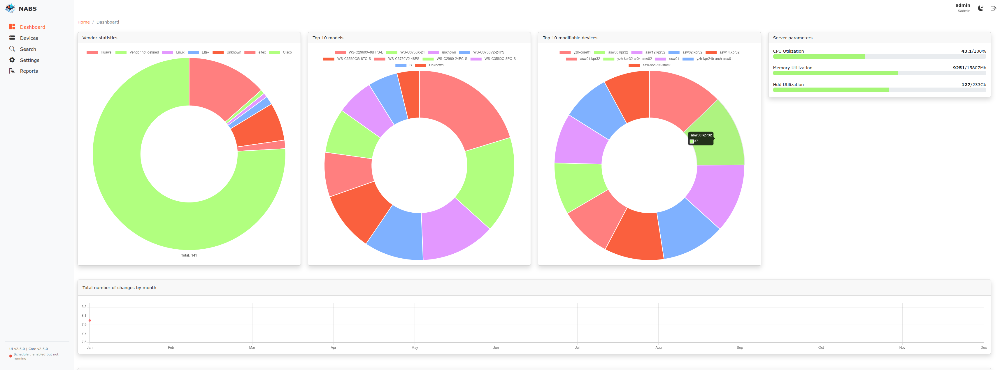
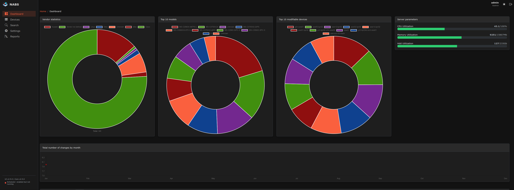
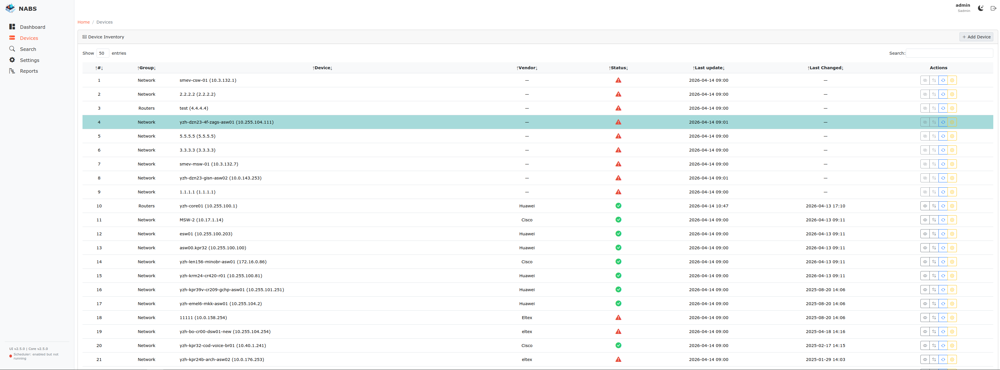
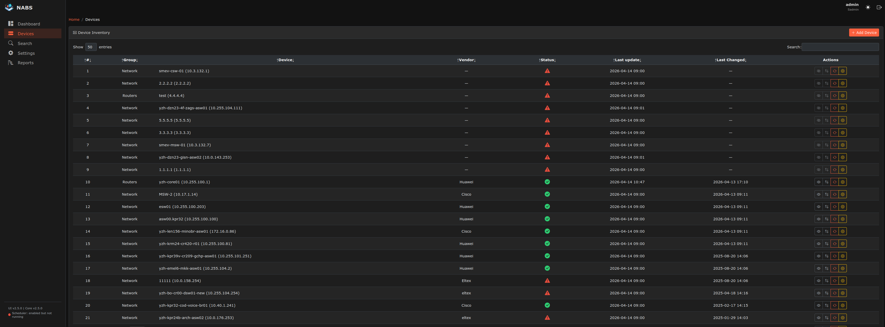
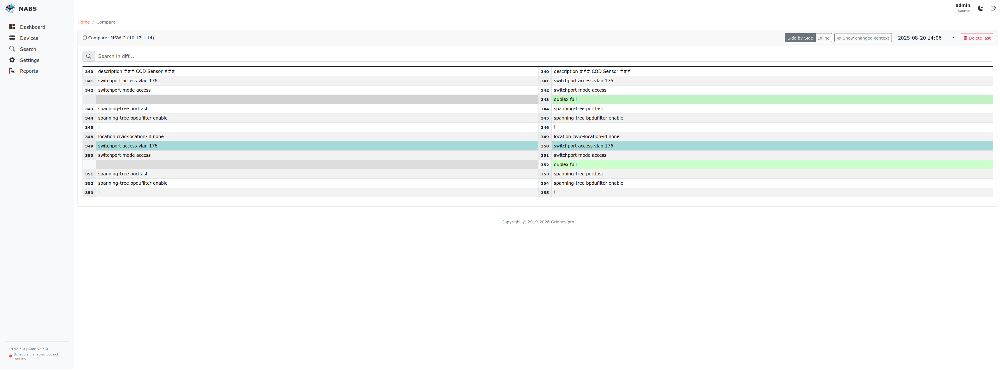
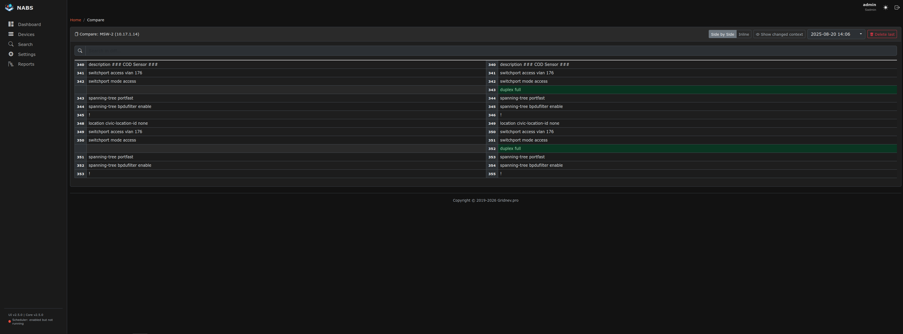

[](https://www.python.org/downloads/release/python-3100/)
[](https://www.python.org/downloads/release/python-3110/)
[](https://www.python.org/downloads/release/python-3110/)
[](https://www.python.org/downloads/release/python-3110/)
[](https://github.com/ambv/black)

# Network Automated BackUp System

This is a network device configuration backup tool.<br/>

**IMPORTANT: READ INSTRUCTIONS CAREFULLY BEFORE RUNNING THIS PROGRAM**


## Requirements
### Software
* python >= 3.10
* nornir
* napalm
* paramiko
* netmiko
* Flask

### Device vendors supported
* Cisco
* Huawei
* Eltex
* If you need another device, then install an additional plugin for NAPALM
* You can create your own drivers in settings
```shell
. venv/bin/activate
pip3 install napalm-"drivername"
```

## Configuration Validation
Beyond backing up configs, NABS can check them against compliance rules you define per driver (e.g. "must contain `aaa new-model`", "NTP servers count >= 2", regex, section-content checks, etc.). Rules run automatically after every backup. See **Settings → Validation Profiles** in the web UI - create a profile, attach it to a driver (or a specific device as a manual override), add rules, and check results per-device on the Devices page or via the per-run report page.

## Screenshots







# Installing

## Ubuntu 20.04 & 22.04
```bash
sudo apt update && sudo apt-get install python3-venv nginx postgresql
```

## Quick install (recommended)
```bash
cd /opt && sudo git clone https://github.com/Sivolen/NABS && cd NABS
./Install_v2.sh --self-signed     # test installation with a self-signed certificate
# production: put certs/cert.pem and certs/key.pem in place first, then
./Install_v2.sh
```
The installer can be run again on an existing installation (update): it never overwrites `config.py`
(secrets, DB settings), never recreates the database and keeps your nginx site and systemd units.
It creates the unprivileged user `nabs` (the services do not run as root), the database and its owner from
the `DB*` settings of `config.py`, installs `nabs` and `nabs-scheduler`, and does not start nginx when the
certificate is missing. Details, checks and rollback: [docs/DEPLOYMENT.md](docs/DEPLOYMENT.md).
The manual steps below do the same by hand.

## Clone repo and install dependencies
* download and setup of virtual environment
```shell
cd /opt
git clone https://github.com/Sivolen/NABS
cd NABS
python3 -m venv venv
. venv/bin/activate
pip3 install --upgrade pip || pip install --upgrade pip
pip3 install wheel || pip install wheel
pip3 install -r requirements.txt || pip install -r requirements.txt
```
## Setup configuration
Copy the [config_example.py](config_example.py) sample settings file to `config.py`.<br/>
The settings of NABS are the Python module `config.py`; there is no YAML configuration.<br/>
Only the optional NetBox device import uses a YAML file: copy [netbox_config_example.yaml](netbox_config_example.yaml) to `netbox_config.yaml` (the name the code reads; it holds the NetBox token and is ignored by git) and edit it according to the [documentation](https://nornir.readthedocs.io/en/latest/tutorial/initializing_nornir.html). Without NetBox, add devices manually with "Add" on the devices page. </br>
All options are described in the example file.

### Required secrets
Two separate secret values must be set in `config.py` before the app will start - it refuses to start with an empty/short one:
```python
# Flask session/CSRF secret key
TOKEN = "..."
# Encrypts saved device SSH passwords - must be DIFFERENT from TOKEN, so
# rotating one doesn't make the other's data unusable
CREDENTIALS_ENCRYPTION_KEY = "..."
```
Generate each one with:
```bash
python3 -c "import secrets; print(secrets.token_urlsafe(32))"
```


## init DB
Database creation
```bash
sudo -u postgres psql
CREATE USER nabs WITH ENCRYPTED PASSWORD 'choose-a-strong-password';
CREATE DATABASE nabs OWNER nabs;
QUIT;
```
The database must be **owned** by the application user: on PostgreSQL 15+ (Ubuntu 24.04) only the owner may create tables in the `public` schema, so `GRANT ALL PRIVILEGES ON DATABASE` alone ends with "permission denied for schema public" in `flask db upgrade`.
Enter the database name, username and password in the configuration file in the fields (the installer takes them from here, so they must match)
```python
DBName = "nabs"
DBUser = "nabs"
DBPassword = "choose-a-strong-password"
```
```bash
. venv/bin/activate
flask db init
flask db migrate
flask db upgrade
```
## Automatic admin creation

On the first start, if no user with the `sadmin` role exists, NABS automatically creates a default administrator:

- **Email:** `admin@admin.local`
- **Username:** `admin`
- **Role:** `sadmin`
- **Auth method:** `local`
- **Password:** randomly generated, printed **once** to console output at that first startup only - it is deliberately **not** written to the application log file (secrets shouldn't sit in rotated/aggregated logs).

If you run NABS via the provided systemd service (`nabs.service`), console output goes to the journal by default, so look it up there right after the very first start:
```bash
journalctl -u nabs --since "10 minutes ago" | grep -A 5 "Default admin user created"
```
If you missed it and the journal has since rotated, the password can't be recovered (it's never stored anywhere) - reset it directly in the database instead:
```bash
. venv/bin/activate
python3 -c "
from app import app, db
from app.models import Users
from werkzeug.security import generate_password_hash
with app.app_context():
    user = Users.query.filter_by(email='admin@admin.local').first()
    user.password = generate_password_hash('YOUR_NEW_PASSWORD_HERE')
    db.session.commit()
    print('Password reset OK')
"
```

You can log in with these credentials and change the password after the first login. This feature eliminates the need to manually run `create_user.py` for the initial setup.

> **Note:** If you need to create additional users or manually set a specific password, you can still use the `create_user.py -a <email>` script.
## Running the web server
```bash
. venv/bin/activate
# For test start
gunicorn -b yourserveraddress:8000 -w 4 app:app
```
The services run as the unprivileged user `nabs`, not as root. It needs to read the application files and
`config.py`, and to write only to `logs/`:
```bash
sudo useradd --system --user-group --no-create-home --home-dir /opt/NABS --shell /usr/sbin/nologin nabs
mkdir -p logs backups user_uploads certs
sudo chgrp nabs config.py && sudo chmod 640 config.py        # secrets: not readable by everybody
sudo chown -R nabs:nabs logs backups user_uploads && sudo chmod 750 logs backups user_uploads
sudo -u nabs test -r config.py && sudo -u nabs test -w logs && echo "rights OK"
```
```bash
sudo cp /opt/NABS/supervisor/nabs.service /etc/systemd/system/nabs.service
sudo systemctl daemon-reload
sudo systemctl enable --now nabs
# Testing starts
systemctl status nabs
```
## Configure Nginx
```bash
# Create dir for ssl certificate
mkdir certs
# Your own certificate: put it at certs/cert.pem and certs/key.pem.
# For a TEST installation only - a self-signed one:
openssl req -new -newkey rsa:4096 -days 365 -nodes -x509 \
  -keyout certs/key.pem -out certs/cert.pem -subj "/CN=localhost"
chmod 600 certs/key.pem

sudo rm -f /etc/nginx/sites-enabled/default
sudo cp /opt/NABS/supervisor/nabs /etc/nginx/sites-available/nabs   # it expects certs/cert.pem and certs/key.pem
sudo ln -sf /etc/nginx/sites-available/nabs /etc/nginx/sites-enabled/nabs
sudo nginx -t && sudo systemctl reload nginx                      # do not reload when the test fails
```
## Restore Engine (experimental)

NABS can restore a stored configuration onto a device (profiles, prechecks, diff, confirmation,
verification, rollback). **No platform is verified on hardware and the only adapter (Cisco IOS / IOS XE)
is off by default.** Read [docs/restore_engine.md](docs/restore_engine.md) before enabling it; it also
describes the extra systemd service (`nabs-restore-worker`) and the database migration.

## Setting up the backup scheduler (systemd service)

The scheduler runs as a separate systemd service (`nabs-scheduler`). It reads the schedule from the database (table `scheduler_settings`), which you can configure via the web interface (**Settings → Scheduler**). The service does not depend on the web server and runs independently.

### 1. Create systemd service symlink
```bash
sudo ln -s /opt/NABS/supervisor/nabs-scheduler.service /etc/systemd/system/nabs-scheduler.service

```
### 2. Reload systemd and enable the service
```bash
sudo systemctl daemon-reload
sudo systemctl enable nabs-scheduler
sudo systemctl start nabs-scheduler
````
### 3. Check the service status
```bash
systemctl status nabs-scheduler
````
### 4. View scheduler logs
```bash
journalctl -u nabs-scheduler -f
````
### 5. Configure the schedule via web UI

   * Log in as sadmin

   * Go to Settings → Scheduler

   * Enable the scheduler, choose interval (seconds) or cron expression

   * Save – changes take effect within a minute

The scheduler will automatically run backuper.py according to the schedule. All backup logs are written to the main application log (/opt/NABS/logs/app_log.log).

> Note: The scheduler works even if the web server is not running. It stores its state in the same PostgreSQL database.

### 5. Automatic cleanup of old configurations

The scheduler also runs a separate daily job (`config_cleanup_job`, every day at 03:00 in `SCHEDULER_TIMEZONE`) that deletes configurations older than `CONFIG_RETENTION_DAYS` days. The latest configuration of every device is **always** kept, even if it is older than the retention period. The job is independent of the backup job and its result is written to `logs/nabs-scheduler.log`.

```python
# config.py
CONFIG_RETENTION_DAYS = 365   # default; e.g. 180 or 730
```

Restart the scheduler after changing the value: `sudo systemctl restart nabs-scheduler`.

Check that the job is registered (the line appears in the log right after the scheduler starts) and when it runs next:

```bash
sudo systemctl restart nabs-scheduler
grep -i "cleanup" /opt/NABS/logs/nabs-scheduler.log | tail
# Job config_cleanup_job added to scheduler (daily at 03:00 ...)
# Config cleanup next run time: ...
```

Run the cleanup manually without waiting for the night (stop nothing, the scheduler may keep running):

```bash
cd /opt/NABS
venv/bin/python scheduler_runner.py --cleanup-now --dry-run   # only report what would be deleted
venv/bin/python scheduler_runner.py --cleanup-now             # really delete
```

### Diff page: "Show changed context"

The **Show changed context** button shows the whole logical block of the config around every change (between two delimiter lines: `#` for Huawei, `!` for Cisco ...), including the delimiter lines. If the vendor has no delimiter, or the config contains none, the old behaviour is used: `DIFF_CONTEXT_LINES` rows before and after a change. Settings in `config.py` (all optional, see `config_example.py`):

```python
USE_CONFIG_BLOCK_CONTEXT = True   # False = always N rows around a change
DIFF_CONTEXT_LINES = 3            # N for the fallback mode and around a change in a cut block
MAX_BLOCK_CONTEXT_LINES = 30      # longer blocks are cut around the change; 0 = never cut
CONFIG_BLOCK_DELIMITERS = {       # key = device vendor, case-insensitive
    "huawei": ["#"],
    "cisco": ["!"],
}
```

A block longer than `MAX_BLOCK_CONTEXT_LINES` is not shown completely. The page shows its opening and closing delimiter, the block header (the first line after the opening delimiter, e.g. `interface ...`), the parent lines of the change (lines with a smaller indent above it, e.g. `bgp 65000` > `ipv4-family ...`) and `DIFF_CONTEXT_LINES` lines around the change. The skipped part is a `⋮ N hidden lines` row: its buttons show 25 more lines from the top (`↓ 25`) or from the bottom (`↑ 25`) of the gap, or all of it (`all`). A block where many lines changed is still shown completely.

A line is a delimiter only if it is exactly equal to it after `strip()` (`#` is a delimiter, `description Test #` is not). A new vendor (Arista, Juniper, MikroTik ...) is added by one line in `CONFIG_BLOCK_DELIMITERS` after checking its real backup configs; the algorithm does not change.

Inside a replaced block the lines are paired by similarity, not by position (`static/js/diff_align.js`): a command added above a changed line no longer makes the changed line be compared with an unrelated new one. Identical lines of the block are shown as unchanged, an edited line is compared with its new version (character/word level), and unrelated old/new lines stay on the same rows without a comparison inside the line. The server diff is not changed.

### Tests

```bash
python -m pytest tests/        # Python tests
node --test tests/js/*.test.js # frontend tests (Node.js 18+, no dependencies)
```

## Running the backup script on crontab
```bash
0 9-21/4 * * 1-5 /opt/NABS/venv/bin/python /opt/NABS/backuper.py >/dev/null 2>&1
```
## You can import network device data from Netbox or add devices manually. 
### Run device import from netbox if you need it.
```bash
0 0 * * 1-5 /opt/NABS/venv/bin/python /opt/NABS/netbox_devices_importer.py >/dev/null 2>&1
```
# Update
* Update NABS and virtual environment
```shell
cd /opt/NABS
sudo git checkout origin/main
sudo git pull
. venv/bin/activate
pip3 install -r requirements.txt || pip install -r requirements.txt
```
* Update DB. **Back up first** (`pg_dump -U nabs nabs > backup.sql`). Since this release the saved password column is TEXT (a password of 16 or more characters did not fit into `VARCHAR(100)`); widen it on an existing database before `flask db migrate`:
```bash
. venv/bin/activate
python scripts/migrate_credentials_password_text.py           # dry run: only looks
python scripts/migrate_credentials_password_text.py --apply   # idempotent, never touches the stored values
flask db stamp head
flask db migrate
flask db upgrade
```
* Check [config_example.py](config_example.py) for new features and copy them into your config.py
* **If upgrading from a version before the `CREDENTIALS_ENCRYPTION_KEY` setting existed**: set it (see "Required secrets" above, must differ from `TOKEN`), back up your database, then run the one-time migration to re-encrypt saved device passwords:
```bash
. venv/bin/activate
pg_dump -U nabs nabs > backup_before_crypto_migration.sql
./migrate_credentials_to_fernet.py        # dry run - just prints what would change
./migrate_credentials_to_fernet.py --apply
```
* The services must not run as root any more. The easiest way to move an existing installation is to run `./Install_v2.sh --skip-nginx` once: it keeps `config.py`, the database, your nginx site and certificates, creates the user `nabs`, fixes the rights of `logs/` and replaces a root unit (a copy `nabs.service.bak-<time>` is kept).
* Reload NABS
```bash
sudo systemctl restart nabs nabs-scheduler
```
# Thanks
Nornir and Napalm teams
# License
This project is licensed under the terms of the **MIT** license.
> You can check out the full license [here](https://github.com/Sivolen/NABS/blob/main/LICENSE)
