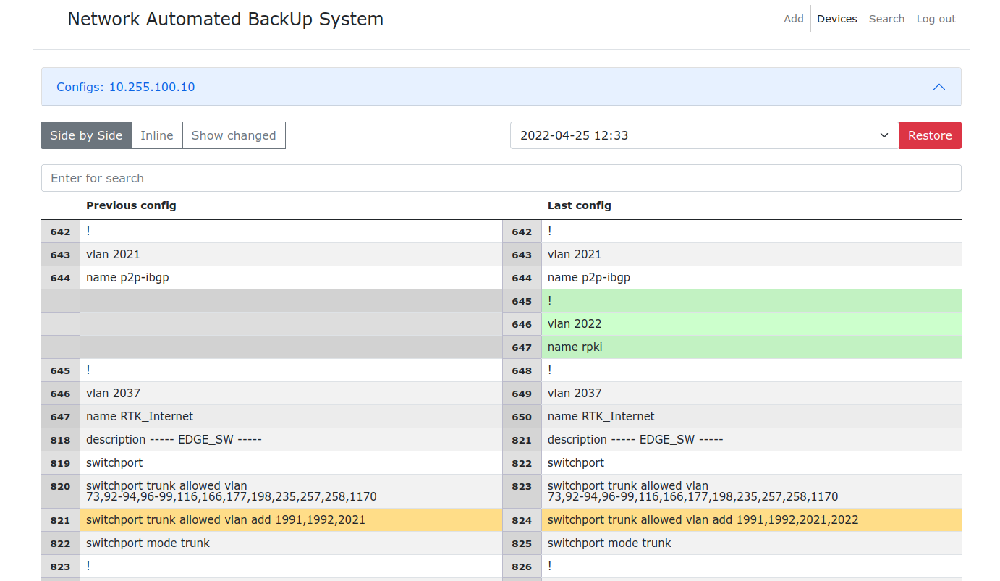

[](https://www.python.org/downloads/release/python-360/)
[](https://www.python.org/downloads/release/python-370/)
[](https://www.python.org/downloads/release/python-380/)
[](https://www.python.org/downloads/release/python-390/)
[](https://github.com/ambv/black)

# Network Automated BackUp System with Nornir

It is a tool for changing or backing up configuration on network devices.<br/>
It receives network data devices from Netbox using Nornir with
nornir_netbox plugin.

**IMPORTANT: READ INSTRUCTIONS CAREFULLY BEFORE RUNNING THIS PROGRAM**


## Requirements
### Software
* python >= 3.8
* nornir
* napalm
* napalm-ce
* napalm-eltex
* nornir-napalm
* nornir-utils
* paramiko
* netmiko
* Flask

### Environment
* NetBox >= 3.0
### Device vendors
* Cisco
* Huawei
* Eltex
* If you need another device, then install an additional plugin for NAPALM

### Screenshots




# Installing

## Ubuntu 18.04 & 20.04
```
sudo apt update && sudo apt-get install python3-venv nginx supervisor postgresql
```

## Clone repo and install dependencies
* download and setup of virtual environment
```
cd /opt
git clone https://github.com/Sivolen/NABS
cd NABS
python3 -m venv venv
. venv/bin/activate
pip3 install -r requirements.txt || pip install -r requirements.txt
```

## Setup
Copy the [config_example.py](config_example.py) sample settings file to `config.py`.<br/>
Copy the [config_example.yaml](config_example.yaml) sample settings file to `config.yaml`.<br/>
If you are not using NetBox, then edit the [config_example.yaml](config_example.yaml) according to the [documentation](https://nornir.readthedocs.io/en/latest/tutorial/initializing_nornir.html). </br>
All options are described in the example file.

# init DB
```
sudo -u postgres psql
CREATE DATABASE NABS;
CREATE USER youruser WITH ENCRYPTED PASSWORD 'NABS';
GRANT ALL PRIVILEGES ON DATABASE NABS TO NABS;
QUIT;
```
```
. venv/bin/activate
flask db init
flask db migrate
flask db upgrade
```
# Running the web server
```
. venv/bin/activate
pip install gunicorn supervisor
# For test start
gunicorn -b yourserveraddress:8000 -w 4 app:app

cp /opt/NABS/supervisor/nabs.conf /etc/supervisor/conf.d/nabs.conf
sudo supervisorctl reload
```
# Configure Nginx
```
# Create dir for ssl certificate
mkdir certs
# Create ssl certificate
openssl req -new -newkey rsa:4096 -days 365 -nodes -x509 \
  -keyout certs/key.pem -out certs/cert.pem
 
sudo rm /etc/nginx/sites-enabled/default
sudo cp /opt/NABS/supervisor/nabs /etc/nginx/available/nabs
sudo ln -s /etc/nginx/sites-available/nabs /etc/nginx/sites-enabled/nabs
sudo systemctl restart nginx
```
# Running the backup script
```
0 */4 * * * /opt/NABS/venv/bin/python /opt/NABS/run_backup.py >/dev/null 2>&1
```

## Thanks
Nornir and nornir_netbox teams

