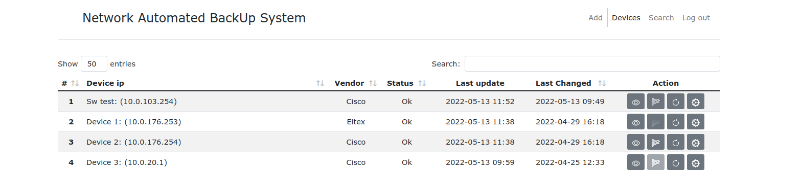
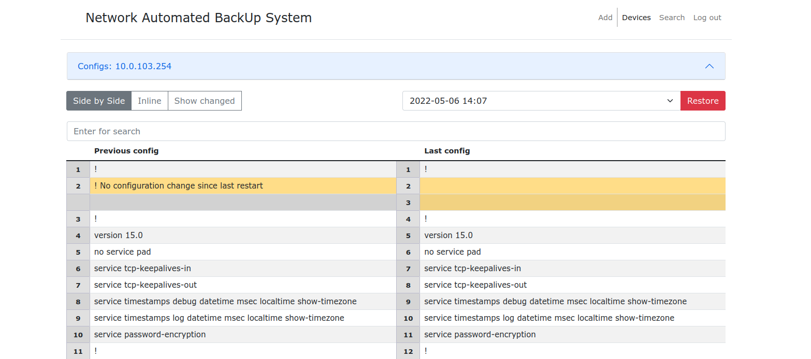

[](https://www.python.org/downloads/release/python-390/)
[](https://www.python.org/downloads/release/python-3100/)
[](https://www.python.org/downloads/release/python-3110/)
[](https://www.python.org/downloads/release/python-3110/)
[](https://github.com/ambv/black)

# Network Automated BackUp System

This is a network device configuration backup tool.<br/>

**IMPORTANT: READ INSTRUCTIONS CAREFULLY BEFORE RUNNING THIS PROGRAM**


## Requirements
### Software
* python >= 3.9
* nornir
* napalm
* paramiko
* netmiko
* Flask

### Device vendors supported
* Cisco
* Huawei
* Eltex
* If you need another device, then install an additional plugin for NAPALM
* You can create your own drivers in settings
```shell
. venv/bin/activate
pip3 install napalm-"drivername"
```

## Screenshots





# Installing

## Ubuntu 18.04 & 22.04
```bash
sudo apt update && sudo apt-get install python3-venv nginx supervisor postgresql
```

## Clone repo and install dependencies
* download and setup of virtual environment
```shell
cd /opt
git clone https://github.com/Sivolen/NABS
cd NABS
python3 -m venv venv
. venv/bin/activate
pip3 install --upgrade pip || pip install --upgrade pip
pip3 install wheel || pip install wheel
pip3 install -r requirements.txt || pip install -r requirements.txt
```
## Setup configuration
Copy the [config_example.py](config_example.py) sample settings file to `config.py`.<br/>
Copy the [netbox_config_example.yaml](netbox_config_example.yaml) sample settings file to `config.yaml`.<br/>
If you are not using NetBox, then edit the [netbox_config_example.yaml](netbox_config_example.yaml) according to the [documentation](https://nornir.readthedocs.io/en/latest/tutorial/initializing_nornir.html) or add devices manually use "Add" on devices page. </br>
All options are described in the example file.

## init DB
Database creation
```bash
sudo -u postgres psql
CREATE DATABASE NABS;
CREATE USER NABS WITH ENCRYPTED PASSWORD 'NABS';
GRANT ALL PRIVILEGES ON DATABASE NABS TO NABS;
QUIT;
```
Enter the username and password from the database in the configuration file in the fields
```python
DBName = "nabs"
DBUser = "nabs"
```
```bash
. venv/bin/activate
flask db init
flask db migrate
flask db upgrade
```

## Running the web server
```bash
. venv/bin/activate
# For test start
gunicorn -b yourserveraddress:8000 -w 4 app:app
```
```bash
cp /opt/NABS/supervisor/nabs.conf /etc/supervisor/conf.d/nabs.conf
sudo ln -s /home/agridnev/PycharmProjects/netbox_config_backup/supervisor/nabs.service /etc/systemd/system/nabs.service
systemctl daemon-reload
systemctl start nabs
systemctl enable nabs
# Testing starts
systemctl status nabs
#sudo supervisorctl reload
```
## Configure Nginx
```bash
# Create dir for ssl certificate
mkdir certs
# Create ssl certificate
openssl req -new -newkey rsa:4096 -days 365 -nodes -x509 \
  -keyout certs/key.pem -out certs/cert.pem
 
sudo rm /etc/nginx/sites-enabled/default
sudo cp /opt/NABS/supervisor/nabs /etc/nginx/available/nabs
sudo ln -s /etc/nginx/sites-available/nabs /etc/nginx/sites-enabled/nabs
sudo systemctl restart nginx
```
## Create user
```bash
users_helper.py -a <email>
```
## Running the backup script on crontab
```bash
0 9-21/4 * * 1-5 /opt/NABS/venv/bin/python /opt/NABS/backuper.py >/dev/null 2>&1
```
## You can import network device data from Netbox or add devices manually. 
### Run device import from netbox if you need it.
```bash
0 0 * * 1-5 /opt/NABS/venv/bin/python /opt/NABS/netbox_devices_importer.py >/dev/null 2>&1
```
# Update
* Update NABS and virtual environment
```shell
cd /opt/NABS
sudo git checkout origin/main
sudo git pull
. venv/bin/activate
pip3 install -r requirements.txt || pip install -r requirements.txt
```
* Update DB
```bash
. venv/bin/activate
flask db stamp head
flask db migrate
flask db upgrade
```

[//]: # (1. [x] If your NABS version < 1.3 you need start dbpatch.py after update)

[//]: # (```)

[//]: # (chmod +x dbpatch.py )

[//]: # (./dbpatch.py )

[//]: # (```)

* Check [config_example.py](config_example.py) for new features and copy them into your config.py
* Reload supervisor
```bash
sudo service supervisor reload
```
# Thanks
Nornir and Napalm teams

# License
This project is licensed under the terms of the **MIT** license.
> You can check out the full license [here](https://github.com/Sivolen/NABS/blob/main/LICENSE)
